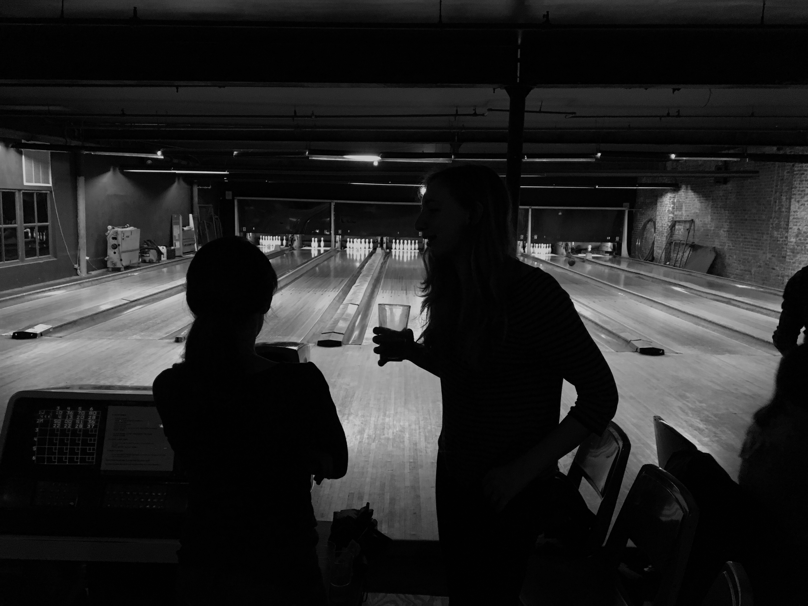

# That rug really tied the room together

Day 14,920

Bowling begins tonight, so naturally, Lebowski comes to mind. Bowling isn't exactly exercise, but it will do tonight. My doctor says I need to get some exercise and she is right. "Time to stand" is probably not going to do the trick. My quantified self isn't going to actually get me in shape. For that you actually need to raise your heart rate for a long period of time--apply resistance and tear tiny fragments of muscle so they can grow back, stronger and fresh.

Or something like that. Nothing a few spins around the park can't fix.

Bowling on the other hand is a good way to unwind.